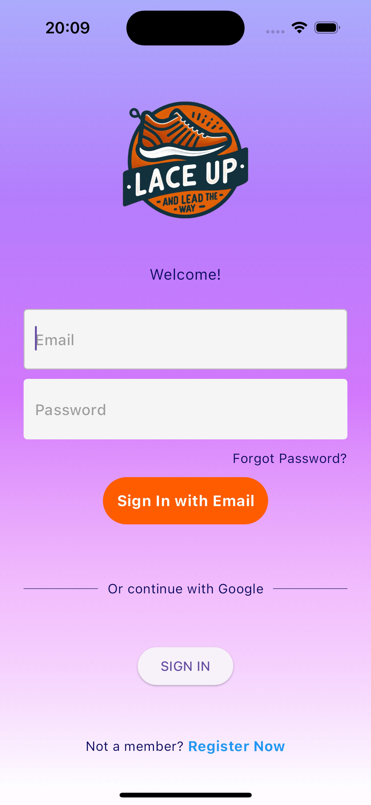
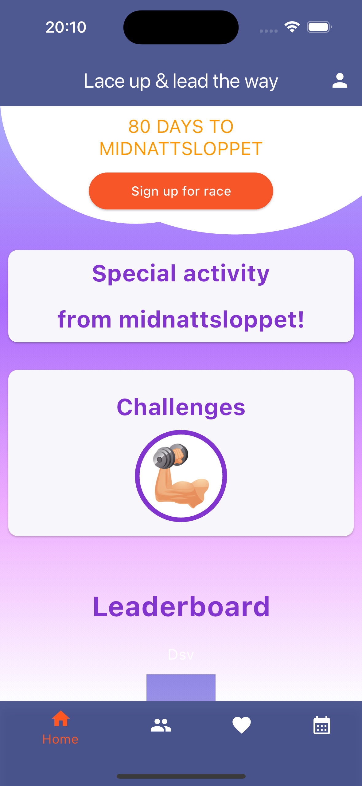
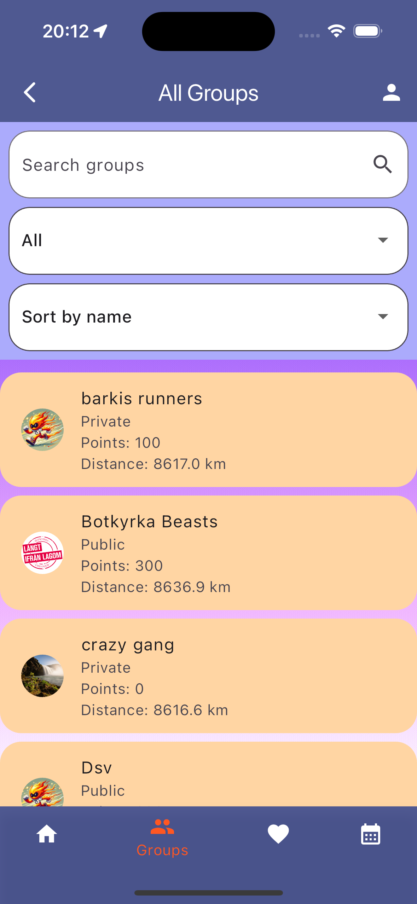
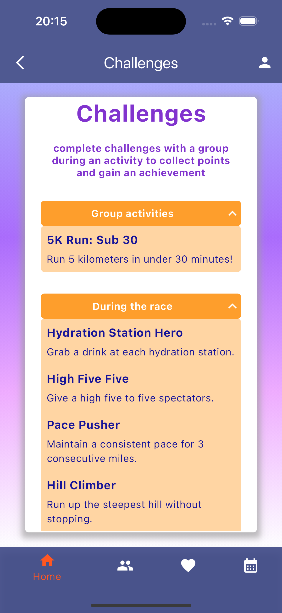
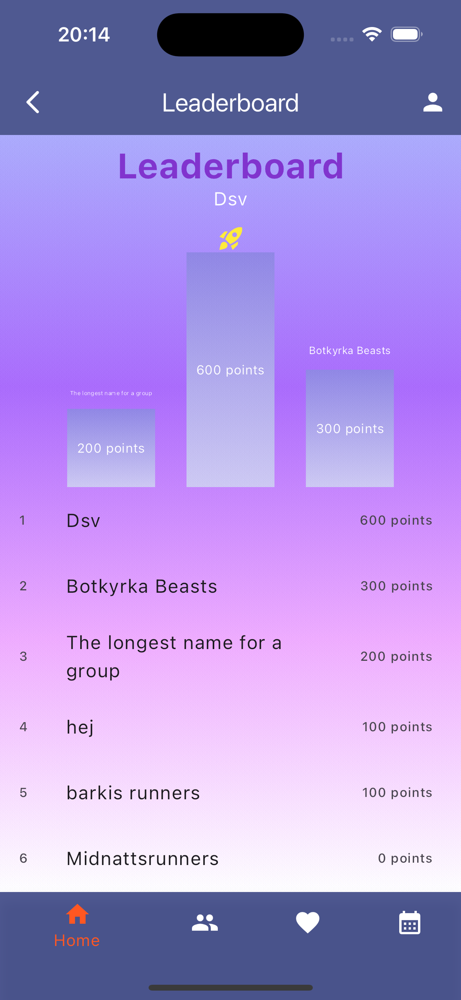

# Group 71 - Lace Up & Lead The Way

## Overview

Lace Up & Lead The Way is a pre-race training app designed to be a companion and social platform for runners interested in running Midnattsloppet. This project is a collaborative effort by group 71 to design and develop a complete mobile app from scratch. The project is part of the PVT 7.5 course at [DSV](https://dsv.su.se). The project includes a frontend, UI and a corresponding backend microservice architecture.

## Team Members

- Edwin Sundberg — Backend lead & Scrum master — [@Edwinexd](https://github.com/Edwinexd)
- Alfred Berggren — Backend & Database design — [@alfredberggren](https://github.com/alfredberggren)
- Thea Ekmark — UX, UI Design & Backend — [@theaekmark](https://github.com/theaekmark)
- Johan Berg Engstrand — Frontend & Backend — [@Johan-Berg-Engstrand](https://github.com/Johan-Berg-Engstrand)
- Enes Ihsan Celik — Frontend — [@enesihsancelik](https://github.com/enesihsancelik)
- Daniel Wiklund — Frontend — [@LuhhDW](https://github.com/LuhhDW)
- Axel Andersson — UX, Frontend & UI Design — [@oltan53](https://github.com/oltan53)
- Noor Abo Hasan — UX & Frontend — [@nooorab](https://github.com/nooorab)
- Sofia Sundin — UX & UI Design — [@SofiaSundins](https://github.com/SofiaSundins)

## Tech Stack

- **Frontend:** [Flutter](https://flutter.dev/)
- **UI Design:** [Figma](https://www.figma.com)
- **Backend:** [FastAPI](https://github.com/tiangolo/fastapi), [SQLAlchemy](https://www.sqlalchemy.org/), [SQLModel](https://github.com/tiangolo/sqlmodel)
- **Database:** [PostgreSQL](https://www.postgresql.org/), [Redis](https://redis.io/)

## Features

### Sign up
  - Passwords are encrypted and safely stored
### Logging in and out
  - Authentication and session handling
### Profiles
  - Each user can create their own profile
  - Profile can be made private
### Groups
  - Users can join or leave them
  - Groups can be private or public
### Activities in groups
  - Can be created by group members
  - Can be scheduled to specific dates
  - Can include planned completion of challenges
### Challenges
  - Can be completed in activities by linking the activity to a certain challenge
  - Example: "Run 2,5km with 100m of elevation change!"
### Achievements
  - Rewarded by completing challenges
  - Or by importing health data from phone
  - Completed achievements will be displayed on users profiles
### Images
  - Ability to upload images to:
    - User profiles
    - Groups
    - Activities
    - and more...
  - Implemented using a microservice connected to S3 Storage
### Sharing
  - Users can share completed achievements or activities
  - The app generates an image specific to each user whenever they complete something
    - This image can be shared to social media (e.g. Instagram or Facebook)
  - Implemented using [Python PIL](https://pypi.org/project/pillow/)

## API Documentation
Documentation of our REST APIs is generated using [Swagger UI](https://github.com/swagger-api/swagger-ui), through usage of FastAPI, and can be viewed by [deploying](#deploying) respective service, and accessing its ```/docs``` endpoint.

## Project Structure
```bash
dsv-pvt/
├── authentication/                 # a microservice handling user authentication
├── backend/                        # a microservice handling general user data
├── flutter_application/            # a client app, sends requests to backend
├── .github/                        # workflows and github related things
├── .gitignore
├── images/                         # a microservice handling image storage
├── LICENSE
├── proxy/                          # proxy coniguration
├── README.md
└── sessions/                       # a microservice handling login session tokens
```
## Deploying
Microservices are to be run in separate processes independently.
A few environment variables need to be set in order for them all to function properly.

### Prerequisites
- [Docker](https://www.docker.com/) — to deploy microservices
- [PostgreSQL](https://www.postgresql.org/) — a database server where RDBMS data can be stored
- [Redis](https://redis.io/) — a database server where bearer tokens can be stored
- Access to S3 storage

### Backend
Enironment variables:
- `API_KEY` — The API that this service requires from external requests to create admin users
- `SESSIONS_URL` — URL to the deployed sessions microservice. No trailing slashes!
- `AUTH_URL` — URL to the deployed authentication microservice. No trailing slashes!
- `IMAGES_API_KEY` — The API Key required in images microservice to upload images to S3
- `IMAGES_URL` — URL to the deployed images microservice. No trailing slashes!
- `DATABASE_URL` — URL to your PostgreSQL database for your general user data


### Authentication
Environment variables:
- `DATABASE_URL` — URL to your PostgreSQL database for authentication data


### Images
Environment variables:
- `API_KEY_ID` — backblaze keyID
- `API_KEY` — backblaze applicationKey
- `KEY_NAME` — blackblaze key name
- `AWS_ENDPOINT_URL` — backblaze endpoint 
- `BUCKET_NAME` — backblaze bucket name
- `API_KEY_SELF` — API key that this service will require to upload images to S3


### Sessions
No environment variables

### Client
Run the flutter application with the following environment variables set:
- `BACKEND_API_URL` — URL to [backend](#backend) service.
- `GOOGLE_APPLE_CLIENT_ID` — clientID to google for iOS devices. This is used for auth with google.
- `GOOGLE_WEB_CLIENT_ID` — clientID for to google for web sessions.

### Alternatives
Alternatively, all services can be run locally using [uvicorn](https://www.uvicorn.org/). In this case, make sure to install all dependencies first!

## Screenshots
<p float="left">










</p>

## Future enhancements
- Friend list
- Reward system
- Displaying groups on a map

## Acknowledgments
- [FastAPI tutorial](https://fastapi.tiangolo.com/tutorial/) for being an excellent resource on API design

## License

Lace Up & Lead The Way is open source and released under the GPL 3.0 license. See [LICENSE](https://github.com/Edwinexd/dsv-pvt/blob/master/LICENSE) for more information.

## Contact

For any questions or concerns, please reach out to [@Edwinexd](https://github.com/Edwinexd) or open an issue in the repository.

